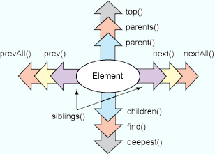

# How to parse HTML in PHP using querypath library
## Intro:
Querypath - HTML DOM parsing and manipulation PHP library  
Original is abandoned. Fork alive here: https://github.com/GravityPDF/querypath


> This is a guide that explains how to parse html,xml documents using querypath. Written from the point of view of web-scraping

##### Sources
Article on ibm.com: [Archive.org  link](https://web.archive.org/web/20160723193833/http://www.ibm.com/developerworks/opensource/library/os-php-querypath/index.html?S_TACT=105AGX01&S_CMP=HP)  
 That link is now dead and un-googleable. So its content now can be freely stolen without guilt.


## Guide: 
Quick example
```php
//Create a new QueryPath object and supply it with source $html page
$qp = QueryPath::withHTML($html);
// find desired html nodes
$linkNodes = $qp->find('a')
//Loop through all the links in the page
foreach ($linkNodes as $li) { 
    echo $li->text() ;
}
// Quickly get title text
$titleText = $qp->find('title')->text();
```
Generally this is the flow:
- We create a querypath object and supply it with the html source. 
- Then Various traversing functions can be used to find matching html nodes.
- We can then optionally loop through the nodes 
- Finally we can use `attr()` or `text()` or other functions to extract from individual nodes

 ## Common traversing methods

| Method | Description | Takes CSS selector? |
|--------|:-----------:|--------------------:|
| find() | Select any element (beneath the currently selected nodes) that matches the selector | Yes |
| xpath() | Select any elements matching the given XPath query | No (XPath query instead) |
| top() | Select the document element (the root element) | No |
| parents() | Select any ancestor element | Yes |
| parent() | Select the direct parent element | Yes |
| siblings() | Select all siblings (both previous and next) | Yes |
| next() | Select the next sibling element | Yes |
| nextAll() | Select all siblings after the present element | Yes |
| prev() | Select the previous sibling | Yes |
| prevAll() | Select all previous siblings | Yes |
| children() | Select elements immediately beneath this one | Yes |
| deepest() | Select the deepest node or nodes beneath this one | No |



> Observe: the traversing functions can accept css/xpath selectors to narrow down the search.

## Advanced usage examples:

###### Convert encoding of html page to utf-8
```php
htmlqp($html, 'body', array('convert_to_encoding' => 'utf-8'))->children('p.a');
```

###### Use chain of traversing functions to find nodes
```php
 $tr = $this->qp->top('body')->find('table[id="main"]')->find('tr:nth-child(3)');
```
Here `top('body')` gets the top most ancestor matching the selector. 
The next find commands use css selectors.  
Same can be written using an xpath
```php
    $tr = $this->qp->xpath('//body/table[@id="main"]/tr[3]');
```

TODO : add more examples as we find them
